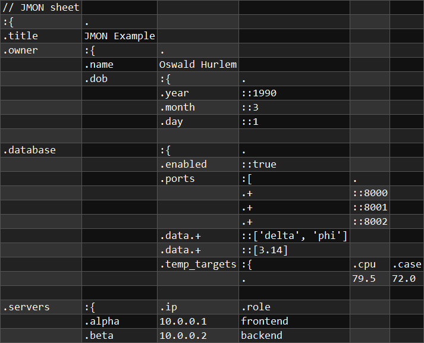

# JMON (JSON-building Matrix Object Notation)

JMON is a tabular plaintext format for configuration and human-produced data.
This repo contains JMON documentation and a reference parser implemented with C# 11 and .NET 7.0.

JMON data is:
- **Stored in a tabular format** like CSV. As with a spreadsheet, there is a grid of cells which each contain elements
   of data expressed as text. Arrays with many elements of the same type are easy to work with.
- **Easy for humans to read and write**, like YAML or TOML. It has concise syntax and allows you to express the
    same data in multiple ways.
- **Semantically equivalent to JSON**. Every JMON document can be converted to JSON without loss of information.
    It is possible to embed JSON directly into a JMON document.

To learn more about JMON, read [JMON by Example](documentation/markdown/JMON_by_Example.md).
Additional minor features are demonstrated in [other_features.csv](documentation/samples/other_features.csv).
Note that JMON is in early development and does not have a spec.

## How to use:

### Command-line (JmonCmd)
`JmonCmd.exe your_jmon_file.csv`

Currently, JmonCmd supports only CSV files. LibJmon supports any format you can parse into a 2D array of strings.

See [documentation/samples](documentation/samples) for sample JMON files.

### Library (LibJmon)
- Use `ApiV0.ParseJmon(string[,] cells, JsonSerializerOptions jsonOptions)` to parse JMON to JSON.
  - Catch exceptions of type `JmonException` to get JMON evaluation errors.

### How to edit JMON files
Use a CSV Editor of your choosing. [Modern CSV](https://www.moderncsv.com/) has worked well for me.
